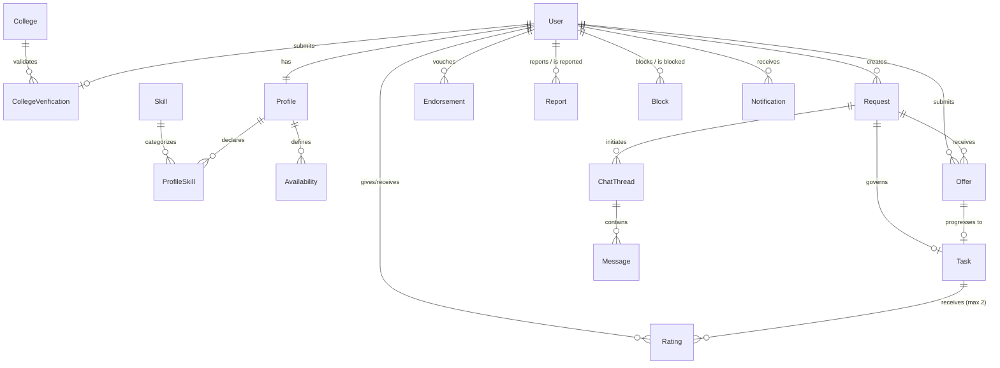
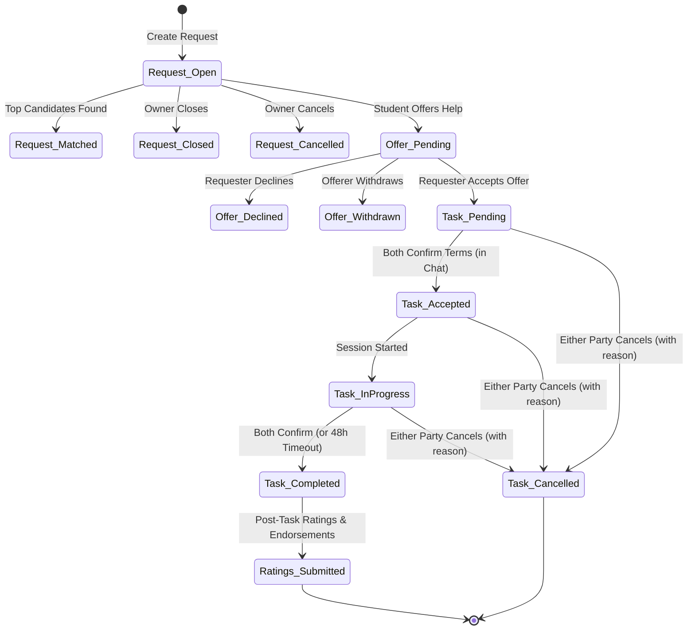

# SkillMate — Backend Architecture & Implementation Plan

**Version:** 1.0 (MVP)  
**Target Market:** Mumbai Metropolitan Region (MMR)  
**Architecture Style:** Modular Monolith  
**Tech Stack:** Node.js, TypeScript, NestJS, PostgreSQL, Prisma ORM, Socket.IO, JWT

---

## 1. Backend Responsibilities

The SkillMate backend serves as the authoritative, secure, and privacy-preserving core for the cross-college student network. Its primary responsibilities include:

1. **Identity & Trust Verification:**
   - Manage user identity, secure credential hashing, and JWT session lifecycle (access + refresh tokens).
   - Enforce college verification workflows (institutional email verification and admin-reviewed ID card uploads).
   - Restrict platform interactions (request creation, offer submission, discovery indexing) strictly to Verified students.

2. **Privacy-Preserving Geolocation:**
   - Map student localities to coarse geographical centroids within the Mumbai Metropolitan Region (MMR).
   - Guarantee that exact residential addresses and precise GPS coordinates are never collected, stored, or exposed.
   - Return only locality names and banded distances (`~2 km away`, `2–5 km away`, `5–10 km away`, `10–20 km away`, `MMR-wide`).

3. **Discovery & Rule-Based Matching:**
   - Provide efficient radius-based and skill-filtered discovery feeds for nearby students and open requests.
   - Implement a deterministic, explainable rule-based matching engine that ranks candidates by skill relevance, availability overlap, geographic proximity, budget fit, and reputation.

4. **Structured Request & Task Lifecycle:**
   - Support three distinct interaction types: `PAID`, `SKILL_EXCHANGE`, and `SOCIAL`.
   - Manage state transitions with concurrency safety: `Request` (`OPEN` → `MATCHED` → `CLOSED` / `CANCELLED`) and `Task` (`PENDING` → `ACCEPTED` → `IN_PROGRESS` → `COMPLETED` / `CANCELLED`).
   - Implement an automated 48-hour completion timeout fallback for unresponsive counterparties.

5. **Scoped Real-Time Communication:**
   - Facilitate 1-to-1 real-time messaging using Socket.IO, strictly scoped to active Request/Offer/Task pairings (no unsolicited DMs).
   - Persist chat history with delivery and read receipts; enforce unilateral blocking directly at the socket and gateway level.

6. **Behavioral Reputation Engine:**
   - Compute aggregate reputation metrics purely from behavioral signals (completion rate, counterpart ratings, qualitative tags, peer skill endorsements, repeat collaborators).
   - Explicitly decouple monetary earnings and transaction sizes from reputation scores.

7. **Safety, Moderation & Recourse:**
   - Enable unilateral, silent blocking and structured reporting across profiles, chats, and tasks.
   - Provide dedicated admin endpoints for reviewing ID verifications, resolving report tickets, and moderating accounts.

---

## 2. Modular Monolith Architecture

The backend is organized into domain-specific modules adhering to NestJS dependency injection patterns. Each module encapsulates its controllers, services, DTOs, and repositories, communicating across modules via well-defined service interfaces so that individual modules (e.g., Discovery, Chat, Matching) can be split into microservices in future phases if scaling warrants.

```text
backend/
├── src/
│   ├── common/                       # Shared guards, decorators, filters, interceptors, utils
│   │   ├── constants/
│   │   ├── decorators/               # @CurrentUser, @Roles, @RequireVerified
│   │   ├── dto/                      # PaginationDto, ApiResponseDto
│   │   ├── exceptions/               # Custom domain exceptions
│   │   ├── filters/                  # GlobalHttpExceptionFilter
│   │   ├── guards/                   # JwtAuthGuard, RolesGuard, VerifiedGuard
│   │   ├── interceptors/             # TransformInterceptor, LoggingInterceptor
│   │   └── pipes/                    # ParseUUIDPipe, ValidationPipe
│   │
│   ├── config/                       # Type-safe configuration schemas (app, auth, database, cors)
│   ├── database/                     # PrismaModule, PrismaService, seed scripts
│   │
│   ├── modules/
│   │   ├── auth/                     # Signup, login, refresh, password hashing, JWT strategy
│   │   ├── users/                    # User account lifecycle, status updates
│   │   ├── colleges/                 # Maintained MMR college directory, search autocomplete
│   │   ├── verification/             # Student verification submissions, college email links, admin review
│   │   ├── profiles/                 # Student profile, bio, area mapping, completeness scoring
│   │   ├── skills/                   # Skill taxonomy, levels (beginner/intermediate/advanced), badges
│   │   ├── availability/             # Recurring weekly slots and specific date/time windows
│   │   ├── discovery/                # Nearby student and request discovery with distance banding
│   │   ├── requests/                 # Typed requests (Paid, Skill Exchange, Social), status management
│   │   ├── offers/                   # Offers on requests, counter-terms, accept/decline/withdraw
│   │   ├── matching/                 # Deterministic rule-based scoring and candidate ranking
│   │   ├── tasks/                    # Agreed terms, status progression, completion confirmation & timeouts
│   │   ├── chat/                     # 1:1 ChatThread management, Socket.IO gateway, message persistence
│   │   ├── reputation/               # Ratings (1-5), tags, skill endorsements, repeat-user calculation
│   │   ├── safety/                   # Reporting system, unilateral silent blocking, admin safety queues
│   │   ├── notifications/            # In-app notification creation, delivery, read tracking
│   │   └── admin/                    # Moderation endpoints for verification and report queues
│   │
│   ├── app.module.ts                 # Root application module
│   └── main.ts                       # Application entry point, Swagger setup, global pipes
│
├── prisma/
│   ├── schema.prisma                 # Authoritative PostgreSQL schema definition
│   ├── migrations/                   # SQL migration history
│   └── seed.ts                       # Initial seed for MMR colleges, localities, standard skills
│
├── test/                             # Unit, integration, and E2E test suites
├── .env.example                      # Documented environment variable template
├── package.json
└── tsconfig.json
```

---

## 3. Database Entities (PostgreSQL Data Model)

The database schema directly implements Section 17 of the PRD with PostgreSQL data types, foreign keys, indexes, and constraints.

### 1. `users`
*Represents the core authentication and identity record.*
- `id`: `UUID` (PK, default `gen_random_uuid()`)
- `phone`: `VARCHAR(20)` (Unique, indexed)
- `email`: `VARCHAR(255)` (Unique, indexed)
- `password_hash`: `VARCHAR(255)` (Required)
- `name`: `VARCHAR(100)` (Required)
- `role`: `ENUM('STUDENT', 'ADMIN')` (Default: `STUDENT`)
- `status`: `ENUM('ACTIVE', 'SUSPENDED')` (Default: `ACTIVE`)
- `created_at`: `TIMESTAMPTZ` (Default: `now()`)
- `updated_at`: `TIMESTAMPTZ`

### 2. `colleges`
*Maintained directory of approved institutions in the Mumbai Metropolitan Region (MMR).*
- `id`: `UUID` (PK)
- `name`: `VARCHAR(255)` (Unique, indexed)
- `city`: `VARCHAR(100)` (Default: `'Mumbai'`)
- `area`: `VARCHAR(100)` (e.g., `'Virar'`, `'Kandivali'`, `'Malad'`, `'Vile Parle'`)
- `email_domains`: `TEXT[]` (Approved domain suffixes for automatic email verification)
- `created_at`: `TIMESTAMPTZ`
- `updated_at`: `TIMESTAMPTZ`

### 3. `college_verifications`
*Trust anchor: records the verification evidence and review state per student.*
- `id`: `UUID` (PK)
- `user_id`: `UUID` (FK to `users.id`, Unique)
- `college_id`: `UUID` (FK to `colleges.id`)
- `department`: `VARCHAR(100)` (e.g., `'Computer Engineering'`, `'Design'`)
- `year_of_study`: `INT` (1, 2, 3, 4, 5)
- `enrollment_id`: `VARCHAR(100)` (Unique per college to prevent identity duplication)
- `college_email`: `VARCHAR(255)` (Nullable, Unique if provided)
- `id_document_ref`: `VARCHAR(500)` (Nullable, restricted object storage path for ID photo)
- `status`: `ENUM('UNVERIFIED', 'PENDING', 'VERIFIED', 'REJECTED')` (Default: `UNVERIFIED`)
- `rejection_reason`: `TEXT` (Nullable)
- `reviewed_by`: `UUID` (Nullable, FK to `users.id` where role is `ADMIN`)
- `reviewed_at`: `TIMESTAMPTZ` (Nullable)
- `created_at`: `TIMESTAMPTZ`
- `updated_at`: `TIMESTAMPTZ`

### 4. `profiles`
*Public-facing student persona, coarse locality, and search metadata.*
- `id`: `UUID` (PK)
- `user_id`: `UUID` (FK to `users.id`, Unique)
- `photo_url`: `VARCHAR(500)` (Nullable)
- `bio`: `VARCHAR(500)` (Nullable)
- `approximate_area`: `VARCHAR(100)` (Predefined MMR locality, e.g., `'Kandivali'`, `'Borivali'`)
- `latitude_bucket`: `DOUBLE PRECISION` (Coarse centroid latitude, internal only, never exposed via API)
- `longitude_bucket`: `DOUBLE PRECISION` (Coarse centroid longitude, internal only, never exposed via API)
- `hourly_rate`: `DECIMAL(10,2)` (Nullable, optional base rate for Paid interactions)
- `completeness_score`: `INT` (0–100, internal matching signal)
- `created_at`: `TIMESTAMPTZ`
- `updated_at`: `TIMESTAMPTZ`

### 5. `skills`
*Standardized master taxonomy of skills and knowledge areas.*
- `id`: `UUID` (PK)
- `name`: `VARCHAR(100)` (Unique, e.g., `'Flutter'`, `'Photoshop'`, `'Python'`, `'Badminton'`)
- `category`: `VARCHAR(100)` (e.g., `'Engineering'`, `'Design'`, `'Academics'`, `'Sports'`)
- `created_at`: `TIMESTAMPTZ`

### 6. `profile_skills`
*Join table mapping skills to student profiles with demonstrated badge statuses.*
- `id`: `UUID` (PK)
- `profile_id`: `UUID` (FK to `profiles.id`)
- `skill_id`: `UUID` (FK to `skills.id`)
- `level`: `ENUM('BEGINNER', 'INTERMEDIATE', 'ADVANCED')`
- `is_verified_skill`: `BOOLEAN` (Default: `false`, automated unlock after multiple rated tasks)
- `created_at`: `TIMESTAMPTZ`
- `updated_at`: `TIMESTAMPTZ`
- *Constraint:* Unique on `(profile_id, skill_id)`

### 7. `availabilities`
*Time windows when a student is free to collaborate.*
- `id`: `UUID` (PK)
- `profile_id`: `UUID` (FK to `profiles.id`)
- `day_of_week`: `INT` (Nullable, 0 = Sunday to 6 = Saturday for recurring slots)
- `specific_date`: `DATE` (Nullable, for one-off availability)
- `start_time`: `TIME` (Required, e.g., `'18:00:00'`)
- `end_time`: `TIME` (Required, e.g., `'21:00:00'`)
- `is_recurring`: `BOOLEAN` (Default: `true`)
- `created_at`: `TIMESTAMPTZ`

### 8. `requests`
*A discoverable, typed ask created by a verified student.*
- `id`: `UUID` (PK)
- `requester_id`: `UUID` (FK to `users.id`)
- `type`: `ENUM('PAID', 'SKILL_EXCHANGE', 'SOCIAL')`
- `title`: `VARCHAR(200)`
- `description`: `TEXT`
- `skill_id`: `UUID` (Nullable, FK to `skills.id`, required for `PAID` / `SKILL_EXCHANGE`)
- `budget`: `DECIMAL(10,2)` (Nullable, strictly required for `PAID`, hidden for others)
- `desired_skill_id`: `UUID` (Nullable, FK to `skills.id`, strictly required for `SKILL_EXCHANGE`)
- `activity_tag`: `VARCHAR(100)` (Nullable, required for `SOCIAL`)
- `availability_window`: `JSONB` (e.g., `{ "date": "2026-09-20", "startTime": "17:00", "endTime": "20:00" }`)
- `approximate_area`: `VARCHAR(100)` (Locality name, e.g., `'Borivali'`)
- `latitude_bucket`: `DOUBLE PRECISION` (Coarse centroid latitude)
- `longitude_bucket`: `DOUBLE PRECISION` (Coarse centroid longitude)
- `status`: `ENUM('OPEN', 'MATCHED', 'CLOSED', 'CANCELLED')` (Default: `OPEN`)
- `created_at`: `TIMESTAMPTZ`
- `updated_at`: `TIMESTAMPTZ`

### 9. `offers`
*A proposal from a verified student to assist on an open request.*
- `id`: `UUID` (PK)
- `request_id`: `UUID` (FK to `requests.id`)
- `offering_user_id`: `UUID` (FK to `users.id`)
- `message`: `TEXT` (Nullable)
- `counter_terms`: `JSONB` (Nullable, counter-budget or adjusted time window)
- `status`: `ENUM('PENDING', 'ACCEPTED', 'DECLINED', 'WITHDRAWN')` (Default: `PENDING`)
- `created_at`: `TIMESTAMPTZ`
- `updated_at`: `TIMESTAMPTZ`

### 10. `tasks`
*The active agreement tracking delivery, execution, and closure.*
- `id`: `UUID` (PK)
- `request_id`: `UUID` (FK to `requests.id`)
- `offer_id`: `UUID` (FK to `offers.id`, Unique)
- `requester_id`: `UUID` (FK to `users.id`)
- `helper_id`: `UUID` (FK to `users.id`)
- `agreed_terms`: `JSONB` (Summary of agreed time, meeting point/online, and budget or exchange skills)
- `status`: `ENUM('PENDING', 'ACCEPTED', 'IN_PROGRESS', 'COMPLETED', 'CANCELLED')` (Default: `PENDING`)
- `requester_completed`: `BOOLEAN` (Default: `false`)
- `helper_completed`: `BOOLEAN` (Default: `false`)
- `completion_timeout_at`: `TIMESTAMPTZ` (Nullable, set when one party marks completed; expires after 48h)
- `status_history`: `JSONB` (Array of transition records with timestamps and triggering user IDs)
- `cancel_reason`: `TEXT` (Nullable)
- `cancelled_by_id`: `UUID` (Nullable, FK to `users.id`)
- `completed_at`: `TIMESTAMPTZ` (Nullable)
- `created_at`: `TIMESTAMPTZ`
- `updated_at`: `TIMESTAMPTZ`

### 11. `chat_threads`
*Private, 1-to-1 conversation context tied to a request/offer.*
- `id`: `UUID` (PK)
- `request_id`: `UUID` (FK to `requests.id`)
- `participant_a_id`: `UUID` (FK to `users.id`)
- `participant_b_id`: `UUID` (FK to `users.id`)
- `is_closed`: `BOOLEAN` (Default: `false`)
- `created_at`: `TIMESTAMPTZ`
- `updated_at`: `TIMESTAMPTZ`
- *Constraint:* Unique on `(request_id, participant_a_id, participant_b_id)`

### 12. `messages`
*Durable record of conversation exchanges.*
- `id`: `UUID` (PK)
- `thread_id`: `UUID` (FK to `chat_threads.id`)
- `sender_id`: `UUID` (FK to `users.id`)
- `content`: `TEXT` (Encrypted/sanitized text content)
- `sent_at`: `TIMESTAMPTZ` (Default: `now()`)
- `delivered_at`: `TIMESTAMPTZ` (Nullable)
- `read_at`: `TIMESTAMPTZ` (Nullable)

### 13. `ratings`
*Post-task two-way evaluation.*
- `id`: `UUID` (PK)
- `task_id`: `UUID` (FK to `tasks.id`)
- `rater_id`: `UUID` (FK to `users.id`)
- `ratee_id`: `UUID` (FK to `users.id`)
- `score`: `INT` (Check: `score >= 1 AND score <= 5`)
- `tags`: `JSONB` (Array of qualitative tags: e.g. `["punctual", "skilled", "communicative"]`)
- `created_at`: `TIMESTAMPTZ`
- *Constraint:* Unique on `(task_id, rater_id)`

### 14. `endorsements`
*Skill vouching by a collaborator following a completed task.*
- `id`: `UUID` (PK)
- `endorser_id`: `UUID` (FK to `users.id`)
- `endorsee_id`: `UUID` (FK to `users.id`)
- `skill_id`: `UUID` (FK to `skills.id`)
- `task_id`: `UUID` (Nullable, FK to `tasks.id`)
- `created_at`: `TIMESTAMPTZ`
- *Constraint:* Unique on `(endorser_id, endorsee_id, skill_id)`

### 15. `reports`
*User safety ticket queued for administrative review.*
- `id`: `UUID` (PK)
- `reporter_id`: `UUID` (FK to `users.id`)
- `reported_user_id`: `UUID` (FK to `users.id`)
- `task_id`: `UUID` (Nullable, FK to `tasks.id`)
- `category`: `ENUM('NO_SHOW', 'HARASSMENT', 'FAKE_PROFILE', 'SCAM', 'OTHER')`
- `description`: `TEXT`
- `evidence_url`: `VARCHAR(500)` (Nullable)
- `status`: `ENUM('OPEN', 'REVIEWED', 'RESOLVED')` (Default: `OPEN`)
- `resolved_by`: `UUID` (Nullable, FK to `users.id`)
- `resolved_at`: `TIMESTAMPTZ` (Nullable)
- `resolution_notes`: `TEXT` (Nullable)
- `created_at`: `TIMESTAMPTZ`
- `updated_at`: `TIMESTAMPTZ`

### 16. `blocks`
*Unilateral, silent relationship shielding.*
- `id`: `UUID` (PK)
- `blocker_id`: `UUID` (FK to `users.id`)
- `blocked_id`: `UUID` (FK to `users.id`)
- `created_at`: `TIMESTAMPTZ`
- *Constraint:* Unique on `(blocker_id, blocked_id)`

### 17. `notifications`
*Persistent user notifications for key asynchronous events.*
- `id`: `UUID` (PK)
- `user_id`: `UUID` (FK to `users.id`)
- `type`: `VARCHAR(50)` (e.g., `'NEW_OFFER'`, `'OFFER_ACCEPTED'`, `'TASK_STATUS_CHANGED'`, `'VERIFICATION_RESULT'`)
- `payload`: `JSONB`
- `read`: `BOOLEAN` (Default: `false`)
- `created_at`: `TIMESTAMPTZ`

---

## 4. Entity Relationships Diagram



---

## 5. Authentication Flow

SkillMate employs standard stateless JWT authentication with refresh token rotation:

1. **Signup (`POST /api/v1/auth/signup`):**
   - Inputs: `name`, `phone`, `email`, `password`.
   - Checks uniqueness of phone and email.
   - Hashes password using `bcrypt` (salt rounds: 10).
   - Generates verification OTP / link token; sets verification status to `UNVERIFIED`.
   - Creates bare `Profile` record linked to user.

2. **Login (`POST /api/v1/auth/login`):**
   - Inputs: `email` (or `phone`) and `password`.
   - Validates existence, account status (`ACTIVE` vs `SUSPENDED`), and password hash.
   - Issues short-lived Access Token (JWT, 15m expiration) containing `{ sub: user.id, role: user.role, isVerified: boolean }`.
   - Issues long-lived Refresh Token (JWT / cryptographically random token, 7d expiration) stored hashed in database or Redis.

3. **Refresh Token (`POST /api/v1/auth/refresh`):**
   - Validates refresh token signature and revocation state.
   - Rotates refresh token (issues new access token + new refresh token, invalidating the old one).

4. **Logout (`POST /api/v1/auth/logout`):**
   - Revokes active refresh token.

---

## 6. Authorization Rules

1. **Public Endpoints (No Bearer Token):**
   - `/api/v1/auth/signup`, `/api/v1/auth/login`, `/api/v1/auth/verify-otp`, `/api/v1/colleges`
2. **Authenticated Student Endpoints (`JwtAuthGuard`):**
   - Browsing profiles, checking own profile, viewing verification status.
3. **Verified Student Endpoints (`JwtAuthGuard` + `VerifiedGuard`):**
   - Only students with `verification.status === 'VERIFIED'` can:
     - Create a Request (`POST /api/v1/requests`)
     - Submit an Offer (`POST /api/v1/requests/:id/offers`)
     - Open Chat Threads and Send Messages
     - Be discovered in `/api/v1/discovery/students`
4. **Resource Ownership Guards:**
   - Requester can only edit/cancel/close their own requests.
   - Only offerer can withdraw their own offer.
   - Only assigned task parties (`requester_id` or `helper_id`) can view task details, update status, or access the related chat thread.
5. **Admin Endpoints (`JwtAuthGuard` + `RolesGuard(['ADMIN'])`):**
   - `/api/v1/admin/verifications/*`
   - `/api/v1/admin/reports/*`
   - `/api/v1/admin/users/:id/suspend`

---

## 7. API Structure

All REST endpoints are prefixed with `/api/v1`.

| Module | Method | Endpoint | Access | Summary |
|---|---|---|---|---|
| **Auth** | POST | `/auth/signup` | Public | Register new user account |
| | POST | `/auth/login` | Public | Authenticate user & issue tokens |
| | POST | `/auth/refresh` | Refresh | Rotate tokens |
| | POST | `/auth/logout` | Auth | Invalidate session |
| | GET | `/auth/me` | Auth | Get current authenticated user |
| **Colleges** | GET | `/colleges` | Public | List colleges with optional search query |
| **Verification** | POST | `/verification` | Auth | Submit college details & proof |
| | GET | `/verification/status` | Auth | Check user verification progress |
| **Profiles** | GET | `/profile/me` | Auth | Get full profile (including private completeness score) |
| | PUT | `/profile/me` | Auth | Update bio, photo, approximate area, rate |
| | POST | `/profile/me/skills` | Auth | Add or update skill & level on profile |
| | DELETE | `/profile/me/skills/:id` | Auth | Remove skill from profile |
| | POST | `/profile/me/availability` | Auth | Add recurring or one-off availability window |
| | DELETE | `/profile/me/availability/:id` | Auth | Remove availability window |
| | GET | `/profile/:userId` | Auth | View sanitized public profile of another student |
| **Discovery** | GET | `/discovery/students` | Auth (Verified) | Discover nearby students filtered by skill/radius |
| | GET | `/discovery/requests` | Auth (Verified) | Discover nearby open requests filtered by skill/radius |
| **Requests** | POST | `/requests` | Auth (Verified) | Create typed request (`PAID`, `SKILL_EXCHANGE`, `SOCIAL`) |
| | GET | `/requests/mine` | Auth | List own requests |
| | GET | `/requests/:id` | Auth | Get request details |
| | PUT | `/requests/:id` | Auth (Owner) | Update open request details |
| | POST | `/requests/:id/close` | Auth (Owner) | Close open request |
| | POST | `/requests/:id/cancel` | Auth (Owner) | Cancel request with reason |
| **Offers** | POST | `/requests/:id/offers` | Auth (Verified) | Submit offer to help on request |
| | GET | `/requests/:id/offers` | Auth (Owner) | List all offers on a request |
| | POST | `/offers/:id/accept` | Auth (Owner) | Accept offer and initialize Task |
| | POST | `/offers/:id/decline` | Auth (Owner) | Decline candidate offer |
| | POST | `/offers/:id/withdraw` | Auth (Offerer) | Withdraw own submitted offer |
| **Tasks** | GET | `/tasks/mine` | Auth | List own active and historic tasks |
| | GET | `/tasks/:id` | Auth (Party) | View task details & agreed terms |
| | POST | `/tasks/:id/status` | Auth (Party) | Update task lifecycle (`accept`/`start`/`complete`/`cancel`) |
| | POST | `/tasks/:id/rate` | Auth (Party) | Submit rating (1–5), tags, and optional endorsement |
| **Chat** | GET | `/chat/threads` | Auth | List own chat threads |
| | GET | `/chat/threads/:id/messages` | Auth (Party) | Paginated message history |
| | POST | `/chat/threads/:id/messages` | Auth (Party) | Send message via REST (fallback) |
| **Safety** | POST | `/reports` | Auth | Submit report ticket against user/task |
| | POST | `/blocks` | Auth | Unilaterally block another user |
| | DELETE | `/blocks/:userId` | Auth | Unblock user |
| **Notifications** | GET | `/notifications` | Auth | List user notifications |
| | POST | `/notifications/:id/read` | Auth | Mark single notification as read |
| **Admin** | GET | `/admin/verifications` | Admin | List pending verifications |
| | POST | `/admin/verifications/:id/decision` | Admin | Approve or reject student verification |
| | GET | `/admin/reports` | Admin | View open safety reports |
| | POST | `/admin/reports/:id/resolve` | Admin | Mark report resolved and take action |
| | POST | `/admin/users/:id/suspend` | Admin | Suspend abusive user account |

---

## 8. Request & Task Lifecycle



---

## 9. Matching Engine (Rule-Based Algorithm)

When a new request is created, the deterministic rule-based matching engine executes the following scoring algorithm:

### Step 1: Candidate Filtering (Hard Gates)
1. Account status must be `ACTIVE`.
2. Verification status must be `VERIFIED`.
3. Candidate ID cannot be the requester ID.
4. Neither user has blocked the other.
5. For `PAID` / `SKILL_EXCHANGE`: Candidate must possess the requested `skill_id` on their profile.
6. Candidate must reside within the maximum search radius (default: 20 km or MMR bounds).

### Step 2: Weighted Scoring (0 to 100 Points)

| Factor | Condition | Score Contribution |
|---|---|---|
| **Skill Relevance** | Exact skill match | **+40 points** |
| | Skill Level: `ADVANCED` | +10 bonus points |
| | Skill Level: `INTERMEDIATE` | +5 bonus points |
| | Skill Level: `BEGINNER` | 0 bonus points |
| **Availability Overlap** | Intersecting time window on request day/date | **+25 points** (Scaled by overlap duration) |
| **Geographic Proximity** | Distance Band: `0–2 km` | **+20 points** |
| | Distance Band: `2–5 km` | **+15 points** |
| | Distance Band: `5–10 km` | **+10 points** |
| | Distance Band: `10–20 km` | **+5 points** |
| **Budget Fit (PAID only)** | Candidate rate $\le$ Request budget | **+10 points** |
| | Candidate has no rate specified (negotiable) | **+5 points** |
| | Candidate rate $>$ Request budget | 0 points |
| **Bidirectional Exchange** | Candidate wants the skill that requester offers | **+20 points** (In place of budget fit) |
| **Reputation Boost** | Completion Rate $\ge 90\%$ | **+5 points** |
| | Average Rating $\ge 4.5$ | **+5 points** |
| | New member / unrated | Neutral baseline (0 points, no penalty) |

The top-N candidates (e.g., top 10) are queued for in-app push notifications.

---

## 10. Real-Time Chat Architecture (Socket.IO)

1. **Protocol:** WebSocket via Socket.IO over `/ws/chat`.
2. **Authentication Handshake:**
   - Client passes `auth: { token: "Bearer <JWT>" }` during connection handshake.
   - Gateway verifies JWT; maps `socket.id` to `userId`.
3. **Room Management:**
   - Rooms are named strictly after the thread UUID: `thread:<threadId>`.
   - On connection, client joins authorized active threads: `socket.join("thread:<threadId>")`.
4. **Message Flow:**
   - Client emits `sendMessage`: `{ threadId, content }`.
   - Gateway verifies membership: `senderId IN (participant_a_id, participant_b_id)`.
   - Gateway verifies no active block exists between participants.
   - Gateway writes message to PostgreSQL inside a durable transaction.
   - Message emitted to room: `io.to("thread:<threadId>").emit("newMessage", message)`.
   - Acknowledgment returned to sender.

---

## 11. Reputation Logic

Reputation is strictly behavioral and is computed dynamically or updated on task completion:

$$\text{Completion Rate} = \frac{\text{Completed Tasks}}{\text{Completed Tasks} + \text{Cancelled Tasks after Acceptance}}$$

- **Average Rating:** Mean of all 1–5 star ratings received as a helper or requester.
- **Qualitative Badges:** Aggregate counts of tags (e.g., `["punctual", "great communicator", "skilled"]`).
- **Verified Skill Badge:** Unlocked for a specific skill once a student has completed $\ge 3$ tasks with an average rating $\ge 4.5$ under that skill.
- **Repeat Collaborators:** Distinct count of peers with $\ge 2$ successfully completed tasks together.
- **Cold Start:** New users display "New Member" status with neutral ranking (never penalized for zero history).
- **Financial Neutrality:** Amount paid or earned is never shown or computed into reputation.

---

## 12. Location & Privacy Architecture

- **No GPS Requirement:** Users are never prompted for live GPS or precise residential addresses.
- **Centroid Mapping:** Predefined dictionary of MMR localities (e.g., *Andheri West, Bandra, Borivali East, Chembur, Dadar, Goregaon, Juhu, Kandivali, Malad, Powai, Thane, Vashi, Virar*).
- **Internal Storage:** Each locality maps internally to a coarse centroid coordinate `(latitude_bucket, longitude_bucket)` used solely for great-circle (Haversine) distance calculations:
  $$d = 2R \arcsin \left( \sqrt{\sin^2\left(\frac{\Delta \phi}{2}\right) + \cos \phi_1 \cos \phi_2 \sin^2\left(\frac{\Delta \lambda}{2}\right)} \right)$$
- **API Masking:** The public API response only exposes:
  1. `approximateArea` (e.g., `"Kandivali"`)
  2. `distanceBand` (e.g., `"~2 km away"`, `"2-5 km away"`, `"5-10 km away"`)
- Raw coordinates are never returned in public profile or discovery DTOs.

---

## 13. Error-Handling Strategy

A global `HttpExceptionFilter` intercepts all errors and maps them to a standardized JSON response:

```json
{
  "success": false,
  "statusCode": 400,
  "error": "Bad Request",
  "message": "Validation failed",
  "details": [
    {
      "field": "budget",
      "issue": "Budget must be greater than 0 for Paid requests"
    }
  ],
  "timestamp": "2026-09-18T22:00:00.000Z",
  "path": "/api/v1/requests"
}
```

Internal unhandled exceptions return HTTP 500 with a generic message in production to prevent leaking database schemas or internal stack traces.

---

## 14. Validation Strategy

1. **Class Validator & Transformer:**
   - DTOs annotated with `class-validator` rules (`@IsNotEmpty()`, `@IsEmail()`, `@IsEnum()`, `@Min()`, `@Max()`).
   - NestJS global `ValidationPipe` enabled with:
     ```typescript
     new ValidationPipe({
       whitelist: true,
       forbidNonWhitelisted: true,
       transform: true,
     })
     ```
2. **Conditional Validation:**
   - `budget` required if `type === 'PAID'`, forbidden for `SKILL_EXCHANGE` or `SOCIAL`.
   - `desiredSkillId` required if `type === 'SKILL_EXCHANGE'`.
   - `activityTag` required if `type === 'SOCIAL'`.

---

## 15. Security Considerations

1. **Password Hashing:** `bcrypt` with work factor 10 or `argon2id`. Plaintext passwords never logged or stored.
2. **CORS:** Restricted strictly to authorized mobile clients or web dashboards.
3. **Helmet:** HTTP response headers secured against XSS, clickjacking, and MIME-sniffing.
4. **Rate Limiting:** `nestjs/throttler` applied globally (100 req/min) and tightened on `/auth/login` (5 req/min) to prevent brute-force attacks.
5. **Data Protection:** Verification ID document pointers (`id_document_ref`) reside in private S3/local buckets accessible only by admin roles; never returned in public profile responses.
6. **Silent Blocking:** Blocks are one-directional and silent to prevent physical retaliation or escalation.
